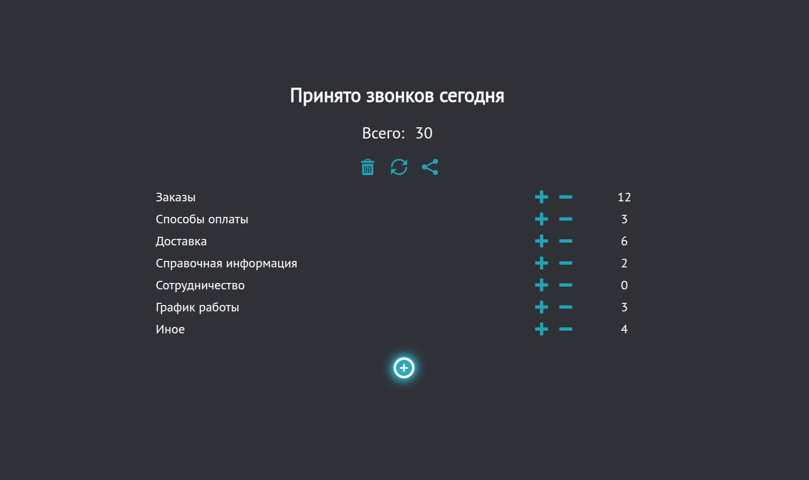

# Plus Minus Counter

  
**Live Demo:** [https://dim272.github.io/PlusMinus.top/](https://dim272.github.io/PlusMinus.top/)

A simple, customizable counter web app designed for tracking everyday tasks. Add, edit, increment, and decrement items with ease. All data is saved locally in the browser, and you can generate and copy reports instantly.

Built with **jQuery** for learning purposes, this project demonstrates practical use of DOM manipulation, event handling, and local storage.

## ✨ Features

- ✅ **Fully editable list** — Add new items, rename labels, and adjust values.
- ➕➖ **Increment and decrement** — Easily modify numeric values with intuitive buttons.
- 💾 **Persists data with `localStorage`** — Your counter stays saved between sessions.
- 📄 **Auto-generated report** — Summarizes all items and totals.
- 📋 **Copy to clipboard** — One-click copy of the report for sharing with colleagues.
- 🧹 **Clear or reset options** — Choose to clear all data or just reset numbers.
- 📱 **Responsive design** — Works well on both desktop and mobile devices.

## 🛠️ Tech Stack

- **HTML / Pug** – Template engine for cleaner markup
- **SCSS** – Styling with modular structure
- **JavaScript (ES6+)** – Core logic
- **jQuery** – DOM manipulation and event handling
- **Gulp** – Build automation (compilation, minification, live reload)
- **BrowserSync** – Development server with hot reload
- **localStorage** – Client-side data persistence

## ⚙️ How to Run Locally

1. Clone the repository:
   <dots>bash
   git clone https://github.com/dim272/PlusMinus.top.git
   cd PlusMinus.top
   <dots>

2. Install dependencies:
   <dots>bash
   npm install
   <dots>

3. Start the development server:
   <dots>bash
   npm start
   <dots>
   This runs the Gulp `start` task, which compiles assets and launches a live-reload server.

4. Open your browser at `http://localhost:3000`.

## 📜 Usage

- Click **+** to add a new counter item.
- Edit any text directly (title or item labels).
- Use `+` and `-` buttons to adjust values.
- Click the **Share** icon to generate a report.
- Use the **Trash** or **Refresh** icons to clear all data or reset values.

## 🎯 Purpose

This project was created to help manage daily repetitive tasks (e.g. tracking calls, messages, or production units). It's also a hands-on exercise in learning **jQuery** and front-end workflow automation with **Gulp**.

## 🙌 Future Ideas

- Export report as `.txt` or `.csv`
- Dark mode toggle
- Drag-and-drop item reordering
- Mobile app wrapper (e.g. with Cordova)

---

Feel free to fork, improve, or adapt it for your own needs!